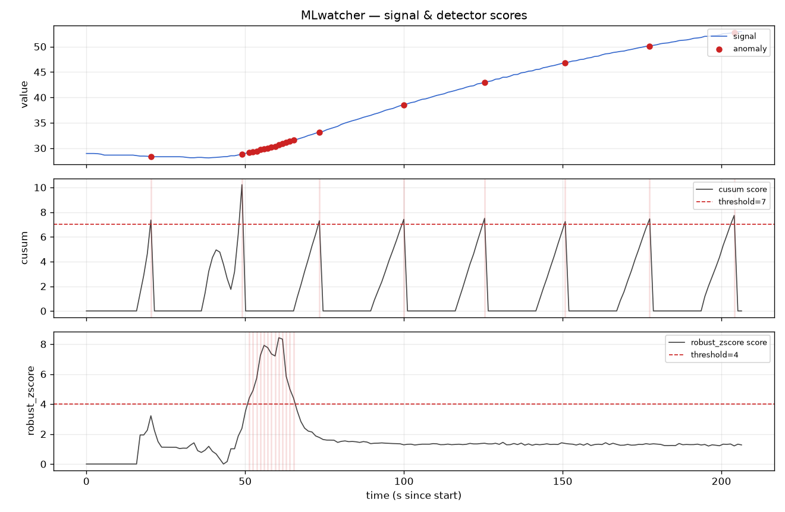
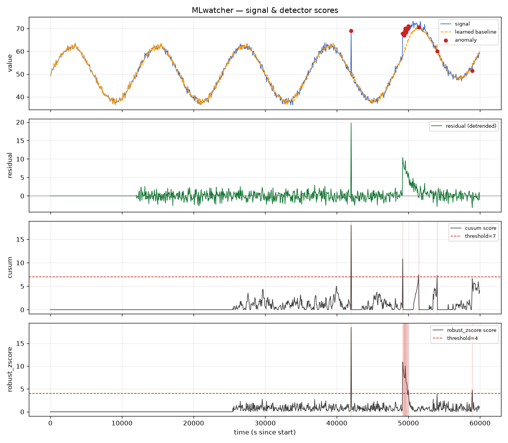
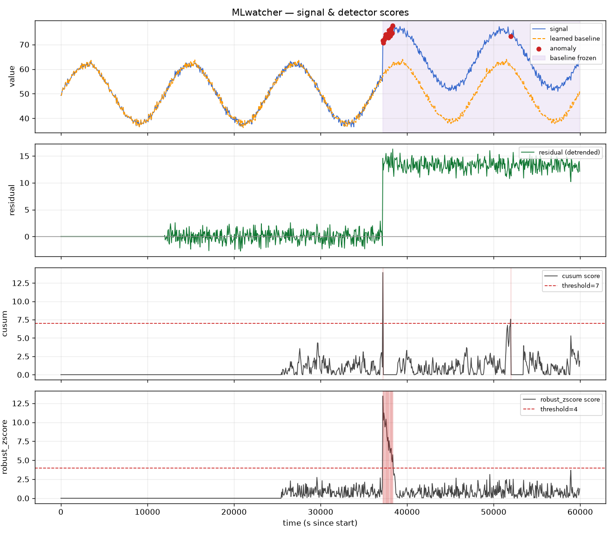
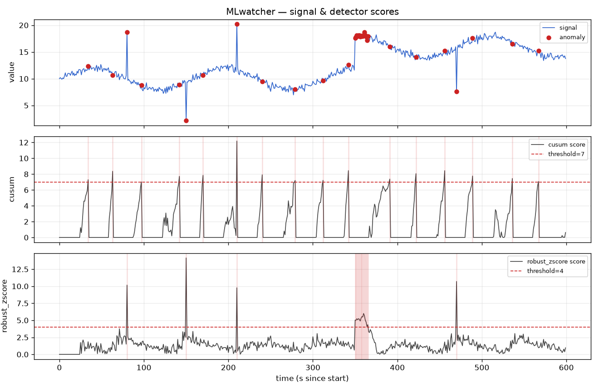

# MLwatcher

Online anomaly & change detection for a **univariate stream**. Feed values in
one at a time; MLwatcher scores each point, flags anomalies and regime changes
when they cross a configurable threshold, logs a full score history, and can
alert (console / webhook / callback) and render a dashboard.

It pairs two complementary detectors so it catches two different failure modes:

| Detector       | Catches                            | Method |
|----------------|------------------------------------|--------|
| `RobustZScore` | **point** anomalies (spikes/dips)  | rolling median + MAD robust z-score |
| `CUSUM`        | **sustained** level shifts (regime changes) | two-sided cumulative sum on standardized residuals |

Using median/MAD (instead of mean/std) keeps the baseline from being poisoned
by the very outliers it's trying to detect. Each update is streaming and cheap
(O(window)), so it runs live indefinitely.

New to the concepts (anomaly vs. change detection, robust statistics, CUSUM,
EWMA/Holt-Winters detrending, thresholds)? See **[STUDY.md](STUDY.md)** — a
from-scratch explainer tied to this code.

## Install

```bash
uv sync                       # core (pure stdlib, no runtime deps)
uv sync --extra dashboard     # + matplotlib for plots
uv sync --extra demo          # + numpy for examples/demo_stream.py
```

## Quick start (library)

```python
from mlwatcher import Watcher, ConsoleSink, HistoryStore

watcher = Watcher(
    sinks=[ConsoleSink()],
    history=HistoryStore("history.jsonl"),
    cooldown=30.0,            # min seconds between alerts per detector
)

for value in live_feed():            # your generator of floats
    obs = watcher.observe(value)     # timestamp defaults to now()
    if obs.is_anomaly:
        ...                          # already alerted + logged
```

`observe()` returns an `Observation` with per-detector `Detection`s (score,
threshold, `is_anomaly`, `kind`). Use `watcher.run(values)` to replay a batch
or backtest.

## Simulate from a CSV

Replay a recorded CSV as if it were a live feed:

```bash
# header CSV with named columns
uv run python -m mlwatcher examples/sample.csv \
    -v temperature -t timestamp \
    --history out.jsonl

# headerless CSV, value in col 1, time in col 0, render a dashboard
uv run --extra dashboard python -m mlwatcher data.csv \
    -v 1 -t 0 --no-header --history out.jsonl --plot dash.png

# pace rows by their real timestamps at 10x speed, POST alerts to a webhook
uv run python -m mlwatcher data.csv -v value -t ts \
    --replay-speed 10 --webhook https://hooks.example.com/...
```

Key flags: `--value-column/-v`, `--time-column/-t` (name or 0-based index),
`--no-header`, `--window`, `--cooldown`, `--replay-speed`, `--history`,
`--webhook`, `--plot`, `--quiet`. Run `-h` for the full list.

There's also a self-contained synthetic demo:

```bash
uv run --extra dashboard python examples/demo_stream.py
```

## Live input: TCLab Arduino

`tclab_stream()` is a *real* live source — it reads a temperature channel off a
connected [TCLab](https://apmonitor.com/heat.htm) Arduino once per period and
yields `(timestamp, value)`, exactly what the watcher consumes:

```python
from mlwatcher import Watcher, ConsoleSink, tclab_stream

watcher = Watcher(sinks=[ConsoleSink()])
for ts, temp in tclab_stream("T1", period=1.0):   # one reading/sec, in °C
    watcher.observe(temp, timestamp=ts)
```

Pass `on_tick=callback(lab, i)` to drive the heaters mid-stream (so there's a
real change to detect), or `use_model=True` to run against TCLab's digital twin
with no hardware attached. The bundled example steps heater Q1 partway through,
producing a sustained ramp that CUSUM flags:

```bash
uv run --extra tclab --extra dashboard python examples/tclab_live.py
uv run --extra tclab python examples/tclab_live.py --model   # no device needed
```

On a real device, with the heater stepped from 0% to 60% at sample 30: the
robust z-score fires a burst on the rising edge (collapsed to a few alerts by
the cooldown), while CUSUM keeps re-triggering across the whole sustained climb:



The CLI speaks TCLab directly too — pass `--tclab` instead of a CSV path:

```bash
# watch T1 live until Ctrl-C, logging history and rendering a dashboard
uv run --extra tclab --extra dashboard python -m mlwatcher --tclab \
    --history out.jsonl --plot dash.png

# 3-minute run that steps heater Q1 to 60% at sample 30 (gives CUSUM a change)
uv run --extra tclab python -m mlwatcher --tclab \
    --tclab-heater 60 --tclab-heater-at 30 --tclab-samples 180 --history out.jsonl
```

Install the extra with `uv sync --extra tclab`.

## Seasonal / trending data (detrending)

The detectors assume a roughly **stationary** baseline. A slow daily cycle or
an upward drift otherwise looks like never-ending "change" and floods you with
false alarms. The fix is to learn that baseline online and score the
**residual** `value - baseline`, which *is* stationary — spikes and genuine
shifts still produce large residuals, so they stay detectable.

Two transforms, passed to `Watcher(detrender=...)` or selected on the CLI:

- **`EWMADetrender(alpha, beta)`** — Holt's linear smoothing for level + slow
  trend. Use for drifting signals with no fixed period (`--detrend`).
- **`SeasonalDetrender(period, alpha, beta, gamma)`** — additive Holt-Winters
  for a repeating cycle of known length. Use for daily/weekly patterns
  (`--period N`).

```python
from mlwatcher import Watcher, SeasonalDetrender

watcher = Watcher(detrender=SeasonalDetrender(period=288))  # 288 = 5-min/day
```

```bash
# CSV with a 200-step cycle; deseasonalize, then watch the residual
uv run --extra dashboard python -m mlwatcher examples/seasonal.csv \
    -v load -t timestamp --period 200 --history out.jsonl --plot dash.png
```

On the demo's strongly-seasonal series, naive detection raises **35** alerts on
the cycle itself; with `--period 200` the cycle is removed and only the genuine
spike and regime shift are flagged. The dashboard gains a "learned baseline"
overlay and a residual panel:



Notes: alerts are suppressed during the transform's warmup (one cycle to seed
the seasonal profile, one to settle); `beta=0` (default) disables trend
tracking.

### Freeze on alert

By default a large *sustained* shift is gradually absorbed into the baseline,
so it shows as a transient that decays (CUSUM still catches the onset). If you'd
rather a permanent shift **stay flagged until acknowledged**, set
`freeze_on_alert=True` (CLI `--freeze-on-alert`): the moment an alert fires the
detrender baseline is frozen, so the residual holds at the shift magnitude
instead of decaying.

```python
w = Watcher(detrender=SeasonalDetrender(period=200), freeze_on_alert=True)
# ... stream data; on a sustained shift the residual stays elevated ...
w.acknowledge()   # accept the new normal: snaps the baseline & resumes learning
```

`acknowledge()` snaps the baseline onto the current value and re-baselines the
detectors, so re-absorption isn't itself mistaken for a slow change. In the
dashboard, frozen spans are shaded; the learned baseline visibly stays at the
old level while the signal sits at the new one:



## Tuning

All thresholds are explicit knobs — "beyond a threshold" is yours to set:

- **`RobustZScore(window, threshold=4.0)`** — higher `threshold` = fewer point
  alerts. `4.0` gives ~0.4 false positives per 400 stationary points here.
- **`CUSUM(window, k=0.5, h=7.0)`** — `k` is the slack (drift below `k` std is
  ignored as noise); `h` is the decision interval (raise for fewer false
  alarms / slower detection). `h=7.0` ≈ 0.5 false alarms per 500 points.
- **`Watcher(cooldown=…)`** — suppress alert bursts. When a level shifts, the
  point detector fires repeatedly until its rolling median catches up; a
  cooldown collapses that into a single alert.
- **`window`** — larger = steadier baseline, slower to adapt to genuine drift.
- **`min_scale`** (both detectors / CLI `--min-scale`) — a floor on the robust
  scale, in the signal's units. On a **quantized** sensor that sits flat, the
  rolling MAD collapses to 0 and a single quantization step would otherwise
  divide by ~0 and score in the millions. Set `min_scale` to roughly the sensor
  resolution (e.g. `0.1` for TCLab's ~0.06 °C) so a flat signal stays quiet
  while genuine jumps are still caught. Default `0.0` keeps the old behavior.

The detectors assume a roughly **stationary** baseline. On strongly trending or
seasonal data, add a detrender (see [Seasonal / trending
data](#seasonal--trending-data-detrending)) so the trend doesn't masquerade as
continuous change.

## Dashboard

`mlwatcher.dashboard.plot_history("history.jsonl", save_path="dash.png")`
renders the signal with flagged points on top, and one score-vs-threshold panel
per detector below.



## Layout

```
src/mlwatcher/
  detectors.py   RobustZScore, CUSUM, Detection
  transforms.py  EWMADetrender, SeasonalDetrender — detrend before scoring
  watcher.py     Watcher — detrend, fan-out to detectors, history, alerts
  alerts.py      Console / Webhook / Callback sinks
  history.py     JSONL score log (append or fresh) + loader
  sources.py     csv_stream() — replay a CSV; tclab_stream() — live TCLab feed
  dashboard.py   matplotlib visualization (optional extra)
  __main__.py    CLI: python -m mlwatcher
examples/        demo_stream.py, sample.csv, seasonal.csv
tests/           pytest suite
```

## Test

```bash
uv run python -m pytest
```

## License

[MIT](LICENSE) © 2026 Stephen B. Johnson.

## Extending

- **New detector:** implement `update(value) -> Detection` and `reset()`, then
  pass it in `Watcher(detectors=[...])`.
- **New alert channel:** any `callable(Alert)` works — wrap one in
  `CallbackSink`, or add to `sinks=[...]`.
- **Multivariate / other modalities:** out of scope for now (this is tuned for
  univariate streams); run one `Watcher` per channel as a stopgap.
